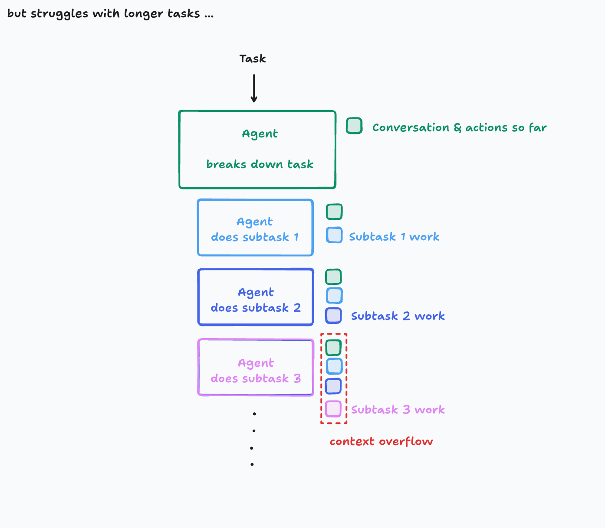
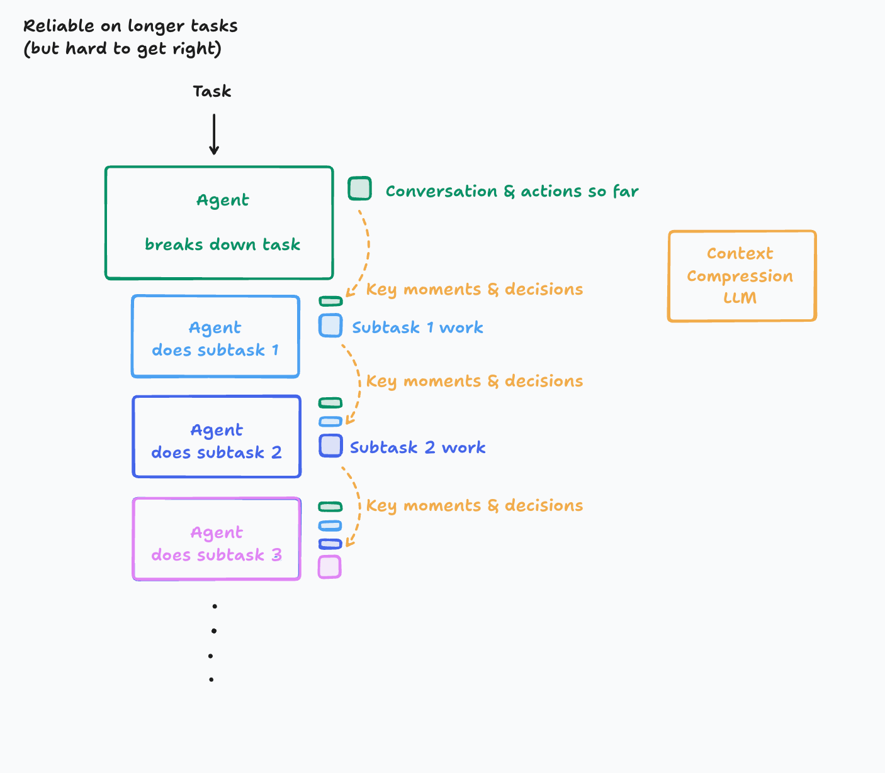

# Context Engineering in React

**Using AI to Transform React Development Workflows**

*From Context Overflow to Context Engineering*

---

## Introduction


https://www.zainfathoni.com/about

---

## 🦾 AI Usage Principles


- Use AI to **enhance** your productivity
- Be the **pilot**, not the passenger
- Iron Man **suit**, not ~~robot~~ :robot:
- <https://x.com/zainfathoni/status/1938256445663023244>

---

## Context 🤯



---

## Context 🛠️



---

## 📋 Agenda

1. 🧪 **Prompting AI for Testable Components**
2. 🔍 **Automated Debugging with AI**
3. ♻️ **Refactoring Legacy Components**
4. 🧩 **AI-Driven Component Decomposition**

---

## 1. 🧪 Prompting AI for Testable Components

### ⚠️ The Challenge

- ⏰ Writing comprehensive tests takes time
- ♿ Ensuring component accessibility
- 🎯 Covering edge cases and user interactions

---

### ✨ The Solution: AI-Powered Test Generation

- 🛠️ **React Testing Library** - User-centric testing approach
- 🌐 **Vitest Browser Mode** - Real browser environment
- 🤖 **AI Prompts** - Generate tests from component specs

---

### 🎬 Demo: From Component to Test

```tsx
// UserProfile.tsx
const UserProfile = ({ user, onEdit }) => (
  <div>
    <h1>{user.name}</h1>
    <button onClick={onEdit}>Edit Profile</button>
  </div>
);
```

---

### 📝 AI Prompt Pattern

> Generate comprehensive tests for this React component using React Testing Library. Include:
>
> - Rendering tests
> - User interaction tests  
> - Accessibility checks
> - Edge cases

---

## 2. 🔍 Automated Debugging with AI

### ⚠️ The Problem

- ⏰ Manual debugging is time-consuming
- 🌐 Hard to reproduce browser-specific bugs
- 🔄 Complex user flows are difficult to test manually

---

### 🚀 Enter AI-Powered Browser Automation

- :performing_arts: **Playwright MCP** - Automated browser interactions
- 🔍 **Visual debugging** - Screenshot comparisons
- 🤖 **AI analysis** - Pattern recognition in failures

---

### 🎬 Demo: Debugging User Flow

```typescript
// AI prompt: "Debug why login fails on Safari"
// 1. Record user actions
// 2. Capture screenshots at each step  
// 3. Analyze console errors
// 4. Generate bug report with fixes
```

---

### 🔄 AI Debugging Workflow

1. 📝 **Describe the bug** to AI
2. 🤖 **Generate test script** automatically
3. 🌐 **Run across browsers** with Playwright
4. 🔍 **AI analyzes failures** and suggests fixes
5. 🔄 **Iterate until resolved**

---

## 3. ♻️ Refactoring Legacy Components

### ⚠️ The Legacy Challenge

- 📜 Old class components with complex lifecycle methods
- 🔗 Mixed concerns and tight coupling
- 📦 Outdated patterns and dependencies
- 😰 Fear of breaking existing functionality

---

### 🎯 AI-Assisted Refactoring Strategy

- :robot: **Code transformation** - Class to functional components
- 🔄 **Pattern migration** - HOCs to custom hooks
- 🧹 **Cleanup automation** - Remove unused code
- 🛡️ **Safety checks** - Preserve existing behavior

---

### 🎬 Demo: Class to Hooks Migration

```jsx
// Before: Class Component (50+ lines)
class UserDashboard extends Component {
  constructor(props) { /* ... */ }
  componentDidMount() { /* ... */ }
  componentWillUnmount() { /* ... */ }
  render() { /* ... */ }
}

// After: Functional Component with Hooks
const UserDashboard = ({ userId }) => {
  const [user, setUser] = useState(null);
  // Clean, modern React patterns
};
```

---

### 🔄 AI Refactoring Workflow

1. 🔍 **Analyze legacy code** structure and dependencies
2. 📋 **Generate migration plan** with step-by-step approach
3. ♻️ **Transform code** while preserving functionality
4. 🧪 **Generate tests** to ensure no regressions
5. 📚 **Update documentation** and type definitions

---

## 4. 🧩 AI-Driven Component Decomposition

### ⚠️ The Monolithic Component Problem

- 🏗️ Components doing too many things
- 🧪 Hard to test individual features
- 🔄 Difficult to reuse parts
- 🎛️ Complex state management

---

### 🎯 AI-Powered Decomposition Strategy

- :brain: **Responsibility analysis** - Identify single concerns
- 🔍 **Pattern recognition** - Find reusable components
- 📦 **Extraction suggestions** - Create focused components
- 🔗 **Composition guidance** - How to connect pieces

---

### 🎬 Demo: Breaking Down a Monster Component

```jsx
// Before: 200+ line ProductPage component
const ProductPage = () => {
  // Product data, reviews, cart, wishlist, 
  // recommendations, user tracking, etc.
};

// After: Composed smaller components
const ProductPage = () => (
  <div>
    <ProductHeader />
    <ProductDetails />
    <ReviewSection />
    <Recommendations />
  </div>
);
```

---

### 🪝 Functional Currying with Custom Hooks

```jsx
// Curried function for creating custom hooks
const useProductData = (productId) => () => {
  const [product, setProduct] = useState(null);
  useEffect(() => fetchProduct(productId), [productId]);
  return product;
};

// Store curried hook with semantic name
const useSpecificProduct = useProductData('123');

const ProductPage = () => {
  const product = useSpecificProduct();
  return <ProductDetails product={product} />;
};
```

---

### 🔄 AI Decomposition Process

1. 🔍 **Analyze component complexity** and responsibilities
2. 🎯 **Identify separation boundaries** using AI insights
3. 🏗️ **Generate component hierarchy** with clear interfaces
4. 🎯 **Create focused components** with single purposes
5. ⚡ **Optimize composition** for reusability and testing

---

## 🎯 Key Takeaways

- 🤖 **AI as Enhancement Tool**: Augment your workflow, don't replace expertise
- 🧪 **Systematic Testing**: AI-generated comprehensive test suites
- 🔍 **Smart Debugging**: Browser automation + visual debugging
- ♻️ **Strategic Refactoring**: Transform legacy code systematically
- 🧩 **Intelligent Decomposition**: Break down complex components with AI
- ⚙️ **Context Engineering**: Structured, repeatable AI practices

---

## 🙏 Thank You

https://zainf.dev/context-engineering-in-react
